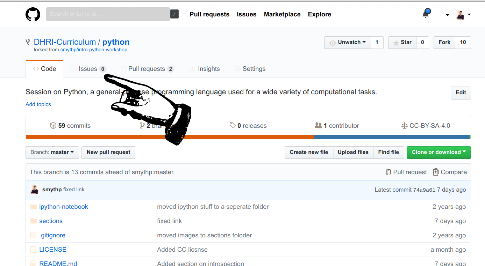
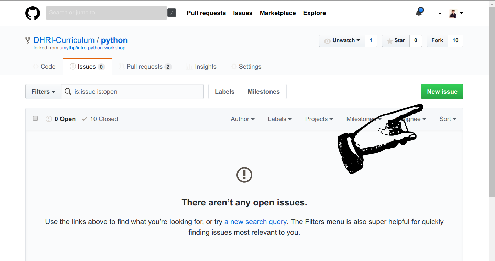
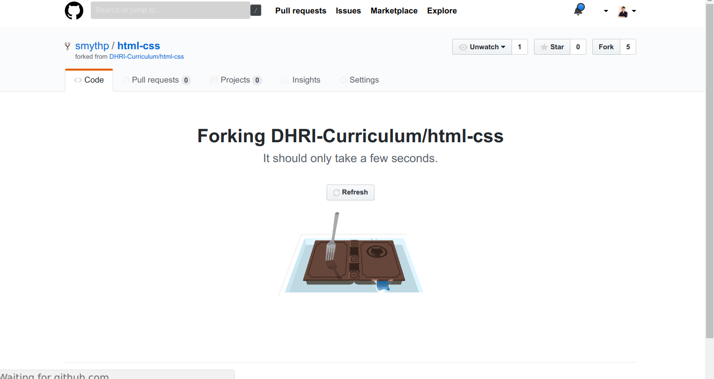
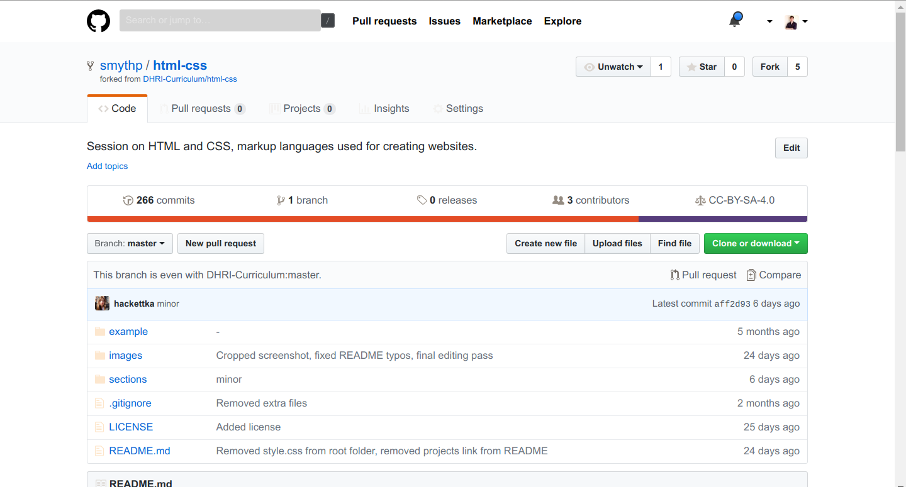
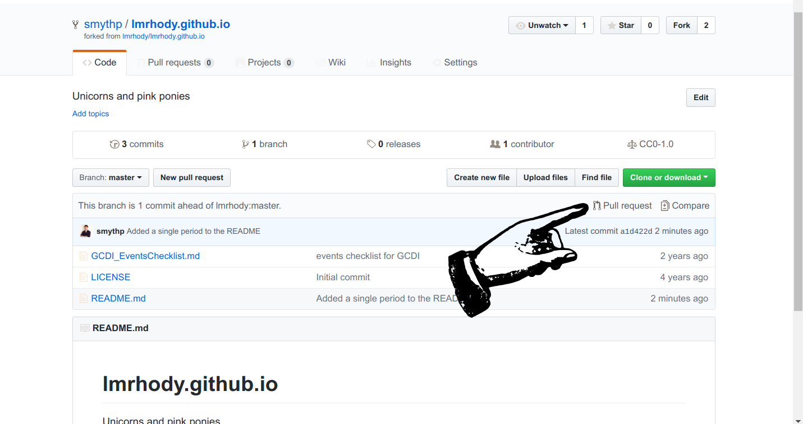
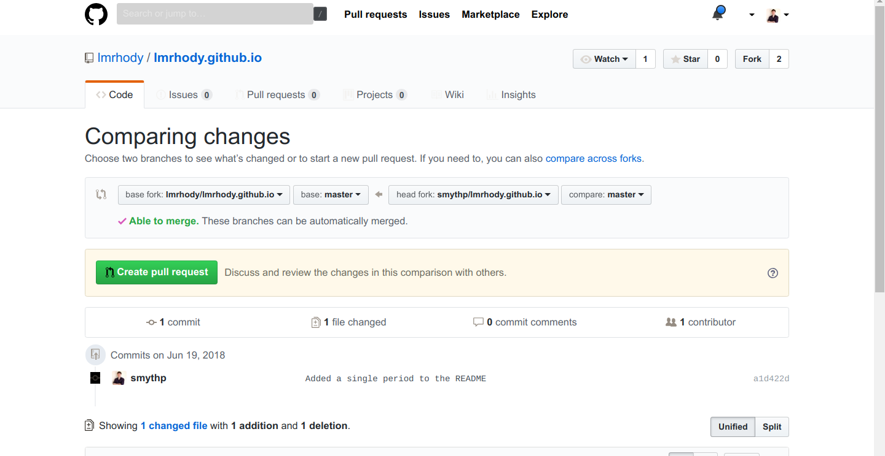
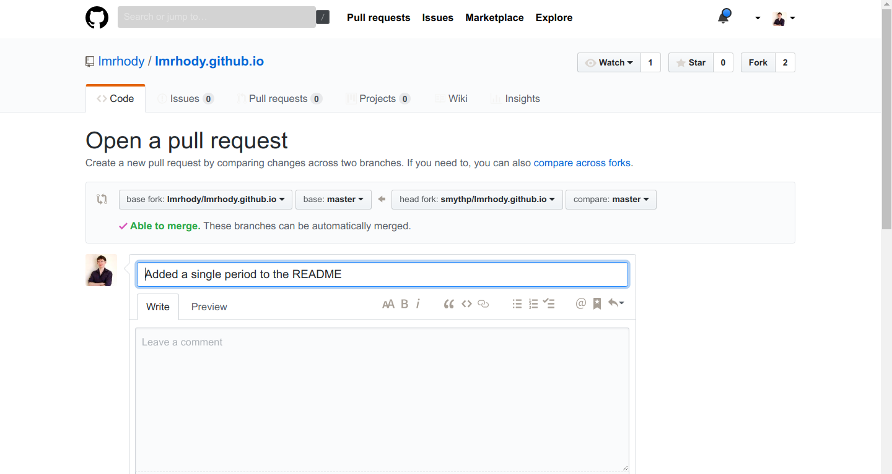

# Contributing to the curriculum

There are many ways to contribute back to the curriculum, from creating issues that suggest improvements to specific modules to creating entirely new sessions. This section describes various modes of interaction with the DHRI curriculum materials, including forking repositories to your account and creating issues and pull requests.

## Creating Issues

A critical and relatively accessible way to contribute back to the DHRI curriculum is to create an issue on GitHub. While reading DHRI curriculum on GitHub, you may encounter inconsistencies, typos, sections that need clarification, or typographical errors. When this happens, you can open an issue to let us know about the problem or potential improvement.

To open an issue, you must be in a GitHub repository. In the menu bar at the top center of the page, click the `Issues` tab.

.

After clicking the issues tab, you will see a screen with the currently open issues, if any. To create a new issue, click the large green button on the right of the page.



On the New Issue page, there is only one required field—the issue title. However, consider leaving a detailed explanation of the issue, including which file you encountered it, if relevant. You can use markdown formatting in the body of your issue.

To complete your issue, click the green button labelled `Submit New Issue`.

![Image showing where the submit new issue button is. In the issue body box, the message reads "In loop.md, I noticed that the index of the example is flowers[1], which is not "rose" as the output indicates. Looks like it should be 0."](finish_new_issue.png).

## Forking

By deffault, you will not have access to directly modify repositories in the DHRI curriculum. In the world of free and open source software, this is common—usually, only the creator of a repository and certain core contributors can add and modify files in a repository. However, this doesn't mean that you cannot modify the curriculum and make it your own.

If you wish to create your own version of the curriculum for your own workshop or Institute, the first step is to **fork** the relevant repository. That means to make a copy of it under your own account on GitHub, one in which you have access to modify files. Once you have forked a repository, you can create a new lesson based on it. Because the curriculum is under a Creative Commons license, you may use any module as the basis for a new lesson and share freely, as long as you provide attribution to Graduate Center Digital Initiatives and share under a the same license.

To fork a repository to your account, click the `Fork` button at the top right of any repository on GitHub.


After clicking the fork button, if you're a member of an organization on GitHub, you may see a screen asking you to which account you wish to fork the repository. Choose your personal account. If you are not a member of an organization, you will not see this screen.

Once you have clicked `Fork` and (possibly) chosen an account or organization, you will see a screen showing you that the fork is in progress:



Once the fork is complete, you will be directed to a screen showing the repository in your own account.



At this point, you can begin to create your own version, or fork,  of the session by cloning this repository to your computer, making changews, and pushing them back up to GitHub.

## Creating a pull request

A pull request allows you to make a specific suggestion or set of suggestions on a repository that can be accepted by the owner of that repository. Basically, you are creating a new version of the target repository, pointing to it, and saying, "This is what I think your repository should look like." If the owner of the target repository agrees with you, they can click a button on GitHub that allows them to incorporate the changes.

To do a pull request takes a few steps:

1. FOrk the repository as above.
2. Clone the forked repository.
3. Make the changes you intend to propose locally.
4. Add, commit, and push your changes to the forked repository.;
5. Using the GitHub interface, initiate the pull requestA pull request allows you to make a specific suggestion or set of suggestions on a repository that can be accepted by the owner of that repository. Basically, you are creating a new version of the target repository, pointing to it, and saying, "This is what I think your repository should look like." If the owner of the target repository agress with you, they can click a button on GitHub that allows them to incorporate the changes.

A pull request allows you to make a specific suggestion or set of suggestions on a repository that can be accepted by the owner of that repository. Basically, you are creating a new version of the target repository, pointing to it, and saying, "This is what I think your repository should look like." If the owner of the target repository agrees with you, they can click a button on GitHub that allows them to incorporate the changes.

Let's step through these steps in more detail.

First, fork the repository to which you wish to submit a pull request. Instructions for forking are available in the previous section on forking.

Next, clone the forked repository to your computer by clicking the `Clone or Download` button, copying the link, and using the

```bash
git clone <copied-link>
```

command in your terminal.

Once you've cloned the repository, use a text editor such as VS Code to make the changes you wish to propose to the target repository. You can make any number of changes in any number of files.

Once you have finished editing, use the add command to stage your changes, commit them, and then push them back to your forked repository on GitHub.

```bash
git add -A
git commit -m "Changes proposed for pull request"
git push
```

Note that you can add files one by one instead of using the `-A` flag to add all files, and that you should use a more specific and description commit message than the generic one provided above.

Once your changes have been pushed to GitHub, open the web interface to the repository and refresh the page. It's easy to miss it in the interface, but there will be a notification about the commit you just made. Within that notification, click the `Pull Request` button.



If you can't find the notification, or if it disappears, you can also begin the pull request process by clicking the `Pull Request` tab and clicking the green `New Pull Request` button.

Once the pull request is initiated, you will encounter a screen that compares the changes between your forked repository and the target repository.



After reviewing, click the green `Create Pull Request` button. You will have a chance to add a comment, and the interface is similar to the interface when creating issues.



After adding a descriptive message, click the green button to finalize the pull request. You will be taken to a view of the completed pull request.

Now it's up to the repository owner if they wish to accept the request, initiate a conversation with you, or—which sometimes happens—ignore or reject your request. In the case of the DHRI curriculum, we may accept some requests right away, and ask for clarification on other occasions.
