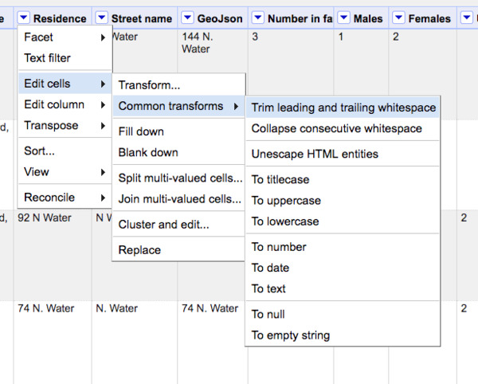

[<<< Previous](introducing-openrefine.md) | [Next >>>](tidy-vs-messy-ii.md)

# Exploring an OpenRefine project

Take a moment to explore our new project. What do you notice? There are many many features, but let's start with three: *sorting*, *filtering*, and *faceting*.

### Sorting

Select the caret to the left of the **Name** column and select sort. This is a useful way of exploring data but does not permanently rearrange the data.

In order to reorder the data permanently, notice the new **Sort** option that appears in the top bar. Selecting the caret beside the new **Sort** option gives you the option to permanently apply a new order to the underlying data.

### Filtering

For the column labeled **Occupation of females compensation**, select **Text filter**. In the menu in the sidebar, enter an occupation.

In how many residences are there recorded female washers? How many males are employed as washers?

### Faceting

For the column labeled **Rent of house**, let's filter the census data based on how much rent tenants were paying.

First, we'll want to convert the column to numeric data by selecting **Edit Cells** -> **Common Transforms** -> **To number**.

Note that not *all* rows were converted, why not?

From the same column, select **Facet** -> **Numeric facet**.

What happens when you slide the minimum and maximum selectors that appear in the sidebar?

## Transforming cells

### Trimming whitespace

One common issue that can cause issues further on down the road are invisible characters -- like spaces, tabs, and carriage returns. Let's trim these annoying invisible characters.

For **Residence**, select **Edit Cells** -> **Common Transforms** -> **Trim leading and trailing whitespace**. 

Next select **Edit Cells** -> **Common Transforms** -> **Collapse consecutive whitespace**. What do you imagine that step does?

### Clustering

Whether in the 1847 handwritten entries themselves or in the process of transcribing them to a digital file, the census data we have is far from consistent. What would be great is the ability to make sure every street name and address descriptor was consistent--across all 4,308 rows.

Here we are going to explore one of several ways we can use OpenRefine to guess what values are most like each other in order to make values more consistent.

For **Residence**, select **Edit Cells** -> **Common Transforms** -> **Trim leading and trailing whitespace**.

Next select **Edit Cells** -> **Common Transforms** -> **Cluster and edit**.

OpenRefine suggests changes and by checking the checkbox beside those suggestions, we can replace all the resulting cells with what is in the textbox to the right.

Notice that you can **Select All** or **Unselect All** from the bottom of the menu.

Select **Merge selected & Re-Cluster**. We can repeat the process until as many times as we want. Note there are other algorithms that will allow us to get slightly different results and that each algorithm has a suite of options to tweak. [Here's a more in-depth treatment of those options.](https://github.com/OpenRefine/OpenRefine/wiki/Clustering-In-Depth)

[<<< Previous](introducing-openrefine.md) | [Next >>>](tidy-vs-messy-ii.md)