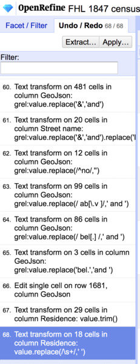
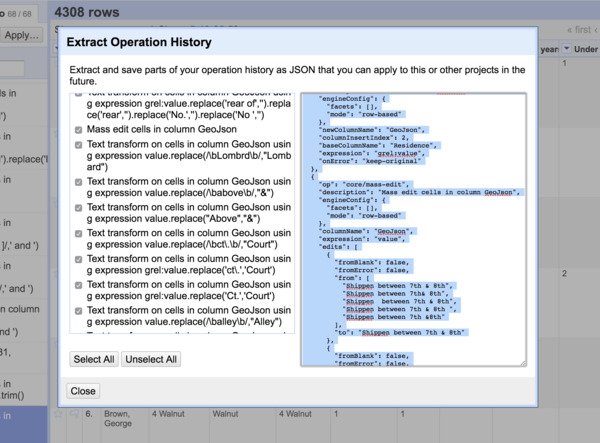
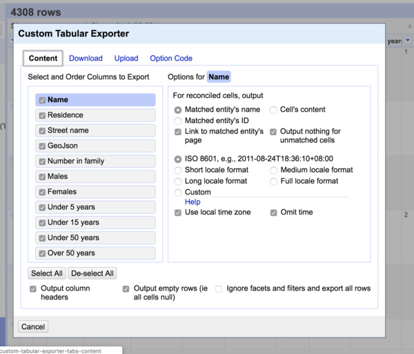

[<<< Previous](deduplicating.md) | [Next >>>](summary.md)

# Exporting data

As we mentioned earlier, rather than opening and saving individual files--an OpenRefine project (mostly) never changes the underlying data. Instead of saving over an existing version of a file, it "bundles" changes together, somewhat like git and GitHub. Rather than saving a file, we can export derivatives of the data according to whatever we need it to look like for a particular use.

## Undo/Redo

Select the **Undo / Redo** tab in the left sidebar. Notice how every change we've made so far is recorded in a list. By selecting any one change in the list, we can go backwards or forwards in time.

  

Select the **Extract** option. We are presented with JSON of every change we made. We can add or delete steps by selecting/unselecting boxes. We can even copy-and-paste the JSON presented in the right column to another project or we can save it should we need to recover every step we took between versions of the data.

## Export

To create a derivative of the data select **Export** and notice the range of options. Select **Custom tabular exporter** and take a glance at the options available. The two we are going to focus on is the selection boxes with which we choose what columns. Note that we can drag the columns and change the order in which they appear.  There is also a checkbox near the bottom right to **Ignore facets and filters and export all rows**. With this, we can choose to only export the data from the rows that appear with our currently active facets and filters.

Now download a CSV with only the **Id**, **Residence**, **Name**, **Street name**, and **Number in family** columns, in that order. Note that you could also upload the spreadsheet straight to a Google Drive folder. This table -- unexciting as it might seem -- is the key to tidy data. With this key to unique residences that were sampled, we can create subsets of the data that answer specific questions like "How many households with children had females that were employed as washers?" or "How do men's reported wages compare to women's?"  *much* more easily than before.

[<<< Previous](deduplicating.md) | [Next >>>](summary.md)