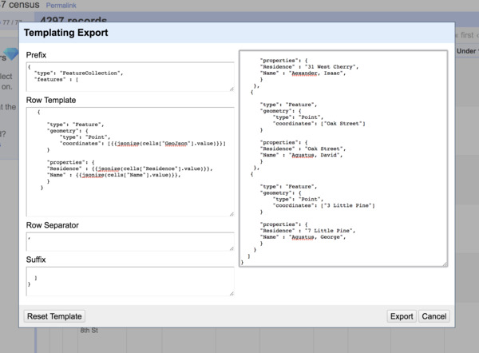

# Extra credit

Now that the data is a little tidier, what else can we do to it? One common transformation is to augment the data or bring in other data to make it more useful. One way of augmenting data is to geocode or return the latitudinal and longitudinal coordinates for mapping purposes. How would we go about turning our street addresses to contemporary coordinates?

1. Cluster and edit to normalize our addresses the best we can.
2. Reconcile historical addresses. 
3. Geocode addresses.
4. Clean up coordinates.

## Cluster and edit

See [exploring OpenRefine](exploring-openrefine.md) to revisit how to cluster and reconcile similar values.

## Reconcile historical addresses

While there are more sophisticated methods and more elaborate historical gazetteers, we could informally begin with [historical alleys](http://www.philahistory.net/alleys.html) and [18th century street-name changes](http://www.philahistory.net/streets.html) from philahistory.net.

## Geocode addresses

Geocoding is a common enough use case that there are many web platforms that offer the service. **Edit Column** -> **Add column by fetching URLs...** using a geocoding service.

We'll use Mapquest's service in this case. The URL for this service is `http://www.mapquestapi.com/geocoding/v1/address?key=[API KEY]&location=ADDRESS+philadelphia+pa`.

Note that you will need to [register for your own key](https://developer.mapquest.com/plan_purchase/steps/business_edition/business_edition_free/register) in order use their Mapquest's servers.

The OpenRefine command we can use is to return the URL follows the pattern `"[base URL]".replace(ADDRESS, value)` -- in other words take the base URL and replace some part of it with the current address.

Instead of simply replacing the unvarnished current address value, we'll get better results if we replace the spaces with plus signs -- `value.replace(' ','+')`.

If we add a couple other parameters to improve accuracy like a bounding box for the Philadelphia area, we end up with following (awful, unwieldy) string.

```
"http://www.mapquestapi.com/geocoding/v1/address?key=[API KEY]&boundingBox=39.82567212768828,-75.30116272998089,40.10143310299512,-74.97319157742591&thumbMaps=false&location=ADDRESS+philadelphia+pa".replace('ADDRESS',value.replace(' ','+'))
```

Note that you will need to replace the `[API KEY]` with your API key.

## Clean up coordinates

Finally, you'll have noticed that the service returns much more than simply the coordinates. How to unpack this?

The result is in JSON, which mean we can parse this as a data object, navigating down the result like a tree. To select the first result, for example, we'd select `parseJson(value).results[0].locations[0]`.

To return the latitudinal coordinate and the longitudinal coordinate separated by a comma, we'd use the fancier command:

```
parseJson(value).results[0].locations[0].latLng.lng + ',' + parseJson(value).results[0].locations[0].latLng.lat
```

## Exporting GeoJSON

Finally, how would we get this out of OpenRefine?

Select **Export** -> **Templating ...** and you'll be presented with quite a lot of control of how you might export the data as JSON.



Geojson is a strict format so you will need to include the following **Prefix**.

```
{
  "type": "FeatureCollection",
  "features" : [
```

And we'll want to replace the **Row Template** with the following. Note how the preview in the right column updates. What do you think the code `{{jsonize(cells["COLUMN NAME"].value)}}` does?

```
   {

      "type": "Feature",
      "geometry": {
          "type": "Point",
          "coordinates": [{{jsonize(cells["GeoJson"].value)}}]
      }

      "properties": {
      "Residence" : {{jsonize(cells["Residence"].value)}},
      "Name" : {{jsonize(cells["Name"].value)}},
      }
    }
```

## Check your work

To test out our data, we can open the file in [the geojson web application geojson.io](http://geojson.io). The open file option is in the top left corner.

What do you notice? What happens if you edit the data that appears in the right sidebar? Are there any outliers? With a properly formatted Geojson dataset, we can now take advantage of any number of mapping platforms.