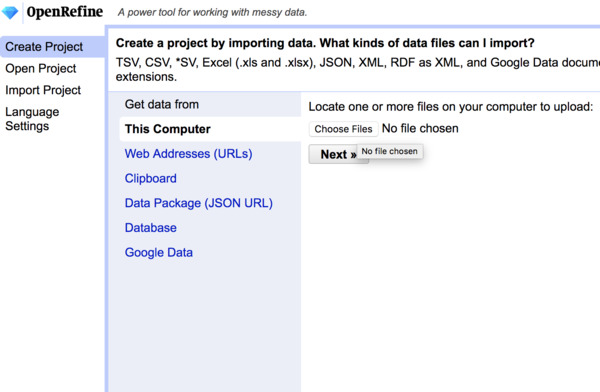
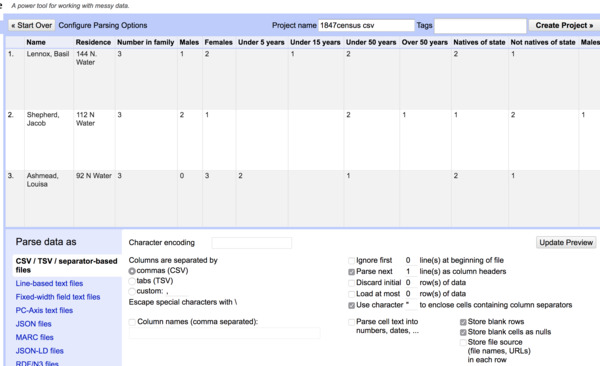

[<<< Previous](tidy-vs-messy.md) | [Next >>>](exploring-openrefine.md)

# What is OpenRefine?

[OpenRefine is cross-platform, open-source software](http://openrefine.org/) that allows users to clean and transform messy data. Originally supported by Google, it is now maintained by a large user community. OpenRefine is by no means the only or best way to work with data; however, it strikes an unusual balance between working in proprietary tools for a broad audience (like Microsoft Excel or GoogleSheets) on the one hand, and on the other, straight programming for data science (R Studio, Python Notebooks).

It allows users to bring in messy data easily without requiring preliminary transformation. It allows for granular auditing of any changes. It combines (relatively) easy to use suite of features with the ability to write custom scripts when needed. It also allows users to parse with lots and lots of data. Microsoft Excel, for example, has a maximum of 1,048,576 rows by 16,384 columns.

A couple things to note about OpenRefine: The software was originally written for the web so it runs in the browser rather than its own window. Rather than opening and saving files, it imports data into a "project" from which we can export versions of data suited to our needs.

If you haven't yet, be sure to download and install OpenRefine according to [the instructions on the installations page](https://github.com/tri-cods/install/blob/master/guides/open_refine.md).

## Importing Data

Like git, OpenRefine is not structured around discrete files that you open and save. Data is imported into a project without affecting the original file. Changes made to that data are bundled together into another file. Rather than saving over or saving multiple copies of data (i.e., `datafile_final-reallyfinal-FINAL.xls`) projects allow users to export derivative files with fine-grained control over how those derivatives should be formed.

1) From the **Create Project** option, select **Choose Files**

2) Having selected the data file, create a project name in the top bar then select **Create Project**. You may also choose from an array of options regarding how to parse that data. Note that you can import both tabular data like CSV's or Excel files as well as nested formats, like JSON or XML.

## Importing Sample Data

For our workshop we are going to be using [historical data derived from an 1847 Quaker census of African Americans living the Philadelphia area](https://raw.githubusercontent.com/swat-ds/datasets/main/1847census/sofaac-raw-export.csv), found in Friends Historical Library. [More context about the dataset](https://ds-pages.swarthmore.edu/paac/) is available in the GitHub repository as well as in [the companion online exhibit](https://ds-pages.swarthmore.edu/paac/).

Now create an OpenRefine project by selecting Create Project after which you have two options:

1) Select This Computer, browse, and navigate to wherever you've saved the file `sofaac-raw-export.csv`
2) Or select Web Addresses (URLs) and enter the URL for the dataset ([https://raw.githubusercontent.com/swat-ds/datasets/main/1847census/sofaac-raw-export.csv](https://raw.githubusercontent.com/swat-ds/datasets/main/1847census/sofaac-raw-export.csv))

In the next screen go ahead and rename the project in the top bar. For now, let's stick with the default settings and voilà, our first project.

[<<< Previous](tidy-vs-messy.md) | [Next >>>](exploring-openrefine.md)